# ML Platform Architecture

A comprehensive guide to the ML platform's architecture, design decisions, and implementation patterns.

## 🏗️ Architecture Overview

### Design Philosophy

The ML platform follows a **layered architecture** with clear separation of concerns, designed for:

- **🔐 Security by Design**: Zero-trust networking with defense in depth
- **👥 Multi-Tenancy**: Team isolation without operational overhead
- **🌍 Cloud Agnostic**: Portable across environments and providers
- **📊 Observable**: Comprehensive monitoring and debugging capabilities
- **🚀 Developer Friendly**: Simple workflows without complexity overhead

### Core Principles

1. **Infrastructure as Code**: Everything is versioned and reproducible
2. **GitOps**: Declarative deployments with audit trails
3. **Team Boundaries**: Clear resource and security isolation
4. **Fail Safe**: Security failures prevent deployment
5. **Cost Conscious**: Resource quotas and optimization built-in

## 🎯 Architectural Patterns

### 1. Three-Layer Terraform Architecture

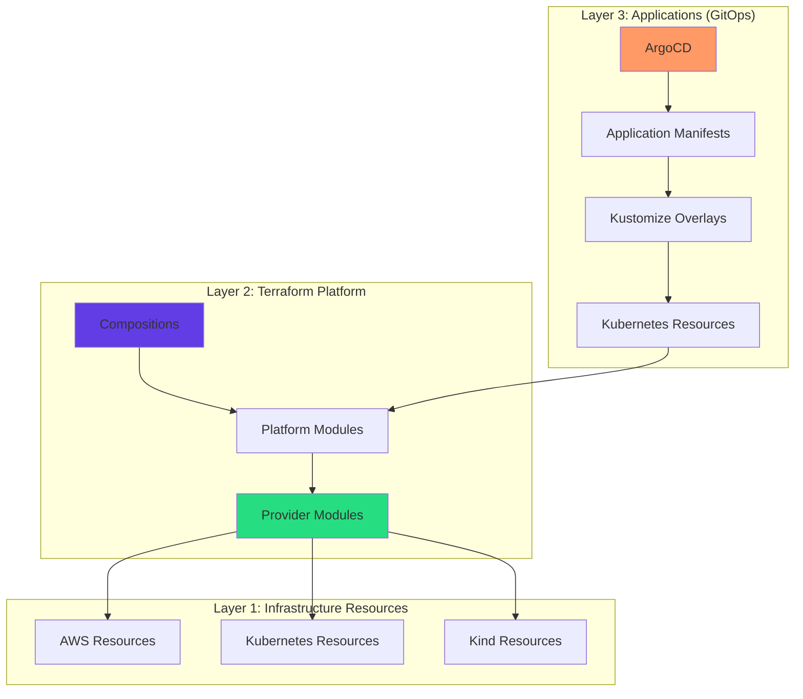

**Layer 1 (Infrastructure Resources)**

- **Purpose**: Actual cloud resources (EKS, RDS, VPC) and local resources (Kind)
- **Technology**: AWS, Kubernetes APIs, Docker
- **Lifecycle**: Long-lived, managed by Terraform
- **Ownership**: Cloud providers and container runtime

**Layer 2 (Terraform Platform)**

- **Compositions**: High-level service orchestration (data-platform)
- **Platform Modules**: Provider-agnostic interfaces (cluster, security, monitoring)
- **Provider Modules**: Provider-specific implementations (aws/cluster, kubernetes/cluster)
- **Technology**: Terraform modules with provider abstraction
- **Ownership**: Platform team

**Layer 3 (Applications)**

- **Purpose**: Deploy and configure applications
- **Technology**: ArgoCD + Kustomize for GitOps
- **Lifecycle**: Frequent deployments
- **Ownership**: Development teams

### 2. Team Isolation Pattern (Actual Implementation)

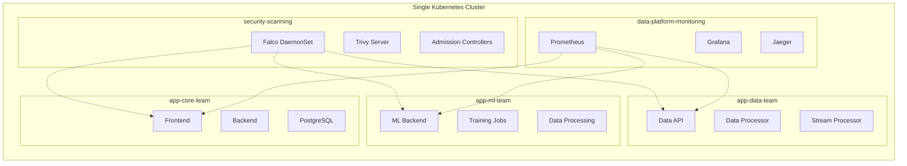

**Benefits**:

- 🔐 **Security**: Network segmentation and RBAC isolation
- 💰 **Cost**: Shared infrastructure reduces overhead
- 🛠️ **Operations**: Single cluster to manage and monitor
- 🚀 **Performance**: Lower network latency between services

**Trade-offs**:

- ⚖️ **Blast Radius**: Cluster-wide issues affect all teams
- 🔧 **Customization**: Limited per-team cluster configuration
- 📊 **Resource Contention**: Teams share underlying resources

### 3. Provider Abstraction Pattern

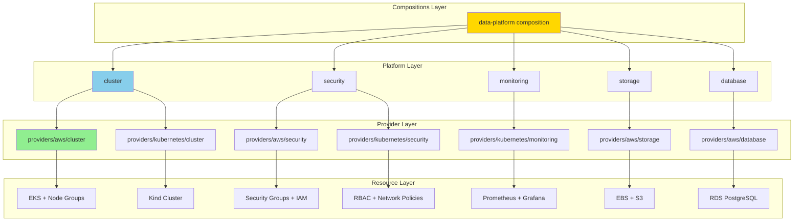

**Benefits**:

- 🌍 **Portability**: Same interface across cloud providers
- 🧪 **Testing**: Local development mirrors production
- 🔄 **Migration**: Easy to switch providers
- 📈 **Scaling**: Environment-specific optimizations

## 🔗 Component Architecture

### Infrastructure Components

#### 1. Compute Layer (Actual Implementation)

```yaml
Local Development (Kind):
  - Kind cluster with gigifokchiman source
  - Single control plane node
  - Worker nodes with different roles
  - GPU simulation with Metal Performance Shaders
  - Custom provider: kind.local/gigifokchiman/kind

Production (AWS EKS):
  - EKS cluster with terraform-aws-modules/eks ~> 20.0
  - Managed node groups with auto-scaling
  - Dedicated GPU node groups (t3.medium, g4dn.xlarge)
  - Cluster autoscaler and VPA enabled
  - IAM roles with OIDC integration
```

#### 2. Storage Layer (Actual Implementation)

```yaml
Local Development:
  - Local path provisioner (rancher.io/local-path)
  - MinIO deployment for S3 compatibility
  - PostgreSQL StatefulSet with persistent volumes
  - Redis deployment for caching

Production (AWS):
  - EBS CSI driver with gp3 volumes
  - S3 buckets with versioning and encryption
  - RDS PostgreSQL with terraform-aws-modules/rds ~> 6.0
  - ElastiCache Redis for production caching
  - Cross-AZ replication and automated backups
```

#### 3. Networking Layer (Actual Implementation)

```yaml
Local Development:
  - Kind extraPortMappings for service access
  - NGINX Ingress Controller with host ports
  - Network policies with default deny-all
  - Internal DNS resolution via CoreDNS

Production (AWS):
  - VPC with terraform-aws-modules/vpc ~> 5.0
  - Private subnets across multiple AZs
  - Application Load Balancer Controller
  - VPC CNI for pod networking
  - Security groups for fine-grained access control
```

### Application Components (Actual Deployed Services)

#### 1. ML Platform Services

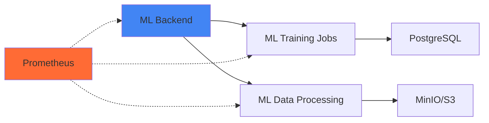

**Actual Components Deployed**:

- 🤖 **ML Backend**: REST API for model management
- 📊 **Training Jobs**: Kubernetes Jobs with GPU support
- 🔄 **Data Processing**: CronJobs for batch data processing
- 📈 **Metrics**: Prometheus metrics with ServiceMonitor
- 🗄️ **Database**: PostgreSQL with persistent storage

#### 2. Data Platform Services

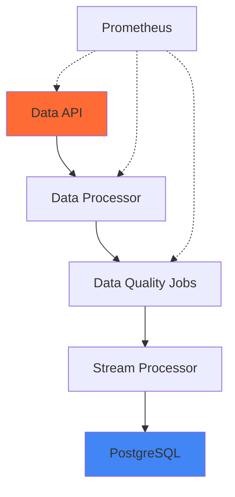

**Actual Components Deployed**:

- 📊 **Data API**: REST API for data access and management
- 🔄 **Data Processor**: Batch data processing jobs
- ✅ **Data Quality Jobs**: Automated data validation
- 📈 **Stream Processor**: Real-time data processing
- 🗄️ **PostgreSQL**: Primary data storage with replication

#### 3. Security & Monitoring Stack

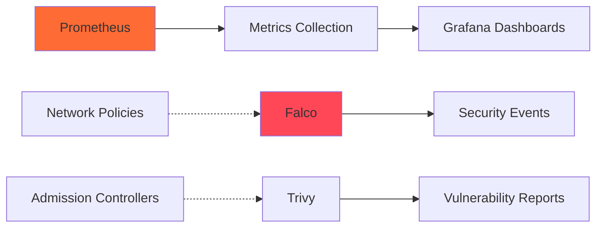

**Actual Security Components**:

- 🛡️ **Falco**: Runtime security monitoring and threat detection
- 🔍 **Trivy**: Container image vulnerability scanning
- 📊 **Prometheus**: Metrics collection with Operator
- 📈 **Grafana**: Dashboards and visualization
- 🔒 **Network Policies**: Zero-trust network segmentation
- 🚫 **Admission Controllers**: Policy enforcement at deployment

## 🔐 Security Architecture

### Defense in Depth Strategy

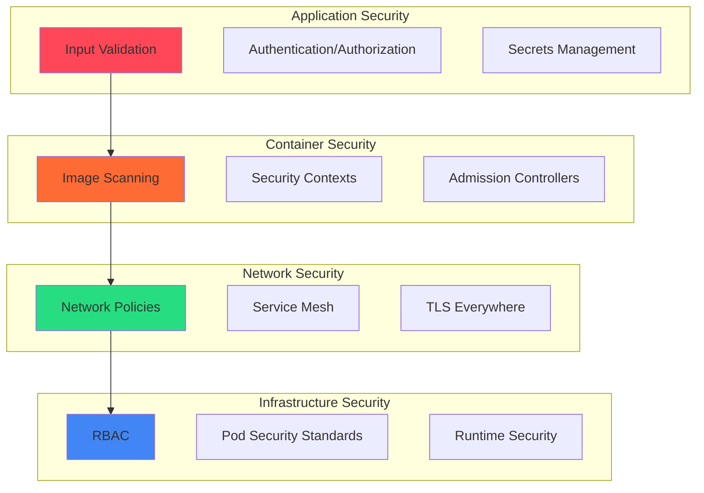

### Security Layers

#### 1. Identity & Access Management

- **Service Accounts**: Minimal permissions per workload
- **RBAC**: Team-scoped permissions with inheritance
- **Pod Security**: Enforced security contexts and standards
- **Admission Control**: Policies prevent insecure deployments

#### 2. Network Security

- **Zero Trust**: Default deny-all with explicit allow rules
- **Microsegmentation**: Service-to-service network policies
- **TLS**: End-to-end encryption for all communications
- **Ingress**: Centralized entry point with rate limiting

#### 3. Runtime Security

- **Falco**: Real-time threat detection and anomaly monitoring
- **Image Scanning**: Trivy for vulnerability detection
- **Compliance**: CIS Kubernetes Benchmark adherence
- **Monitoring**: Security event correlation and alerting

## 📊 Observability Architecture

### Three Pillars of Observability

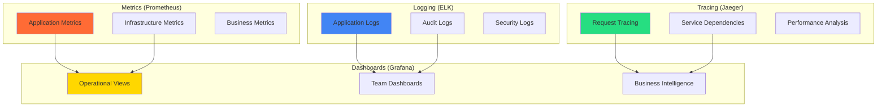

### Monitoring Strategy

#### 1. Application Monitoring

- **📈 Metrics**: RED/USE methodology for service health
- **📋 Logging**: Structured logging with correlation IDs
- **🔍 Tracing**: End-to-end request flow visualization
- **🚨 Alerting**: Proactive issue detection and escalation

#### 2. Infrastructure Monitoring

- **🖥️ Resource Usage**: CPU, memory, storage, network
- **🔄 Performance**: Latency, throughput, error rates
- **💰 Cost**: Resource utilization and optimization
- **🔐 Security**: Threat detection and compliance monitoring

#### 3. Business Monitoring

- **👥 User Experience**: Application performance from user perspective
- **📊 Feature Usage**: Product analytics and adoption metrics
- **💼 SLA Compliance**: Service level objectives and reporting
- **📈 Growth Metrics**: Platform adoption and scaling trends

## 🚀 Deployment Architecture

### GitOps Workflow

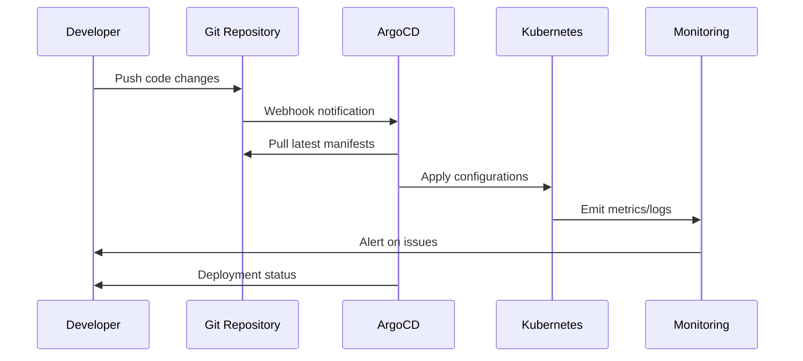

### Environment Promotion

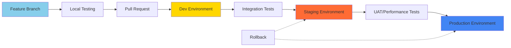

### Deployment Strategies

#### 1. Blue-Green Deployment

- **Purpose**: Zero-downtime deployments with instant rollback
- **Use Case**: Critical production services
- **Trade-off**: Requires 2x resources during deployment

#### 2. Canary Deployment

- **Purpose**: Gradual rollout with risk mitigation
- **Use Case**: High-traffic services with complex dependencies
- **Trade-off**: Longer deployment time, complex routing

#### 3. Rolling Update

- **Purpose**: Standard deployment with resource efficiency
- **Use Case**: Most application deployments
- **Trade-off**: Brief service degradation possible

## 🎯 Scaling Architecture

### Horizontal Scaling

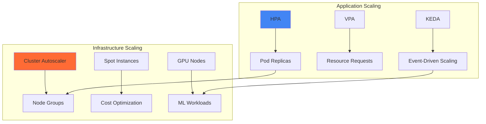

### Performance Optimization

#### 1. Resource Management

- **Requests/Limits**: Right-sized containers with burst capacity
- **Quality of Service**: Guaranteed, Burstable, and BestEffort classes
- **Node Affinity**: Workload placement optimization
- **Resource Quotas**: Team-level resource governance

#### 2. Caching Strategy

- **Application Cache**: Redis for session and data caching
- **CDN**: CloudFront/CloudFlare for static asset delivery
- **Database Cache**: Read replicas and query optimization
- **DNS Cache**: Improved service discovery performance

#### 3. Network Optimization

- **Service Mesh**: Istio for advanced traffic management
- **Load Balancing**: Multiple algorithms for different workloads
- **Connection Pooling**: Reduced connection overhead
- **Compression**: Gzip/Brotli for data transfer optimization

## 🔄 Data Architecture

### Data Flow Pattern

```mermaid
graph LR
    subgraph "Ingestion"
        A[APIs] --> D[Message Queue]
        B[Streams] --> D
        C[Batch Jobs] --> D
    end
    
    subgraph "Processing"
        D --> E[Stream Processing]
        D --> F[Batch Processing]
        E --> G[Feature Store]
        F --> G
    end
    
    subgraph "Storage"
        G --> H[Data Lake]
        G --> I[Data Warehouse]
        H --> J[ML Models]
        I --> K[Analytics]
    end
    
    style D fill:#231f20
    style G fill:#26de81
    style H fill:#4285f4
```

### Data Governance

#### 1. Schema Management

- **Schema Registry**: Centralized schema evolution and compatibility
- **Data Contracts**: API-first approach to data interface design
- **Versioning**: Backward/forward compatibility guarantees
- **Validation**: Runtime schema enforcement and error handling

#### 2. Data Quality

- **Monitoring**: Automated data quality checks and alerts
- **Lineage**: End-to-end data flow tracking and impact analysis
- **Testing**: Unit and integration tests for data pipelines
- **SLA**: Data freshness and accuracy service level agreements

#### 3. Privacy & Compliance

- **Encryption**: Data at rest and in transit protection
- **Access Control**: Attribute-based access control (ABAC)
- **Audit**: Comprehensive data access and modification logging
- **Retention**: Automated data lifecycle management

## 📈 Future Architecture Considerations

### Short-term Enhancements (3-6 months)

1. **Service Mesh Implementation**
    - **Technology**: Istio or Linkerd
    - **Benefits**: Advanced traffic management, security, observability
    - **Complexity**: Additional operational overhead

2. **Multi-Region Setup**
    - **Technology**: Cross-region replication and failover
    - **Benefits**: Disaster recovery and reduced latency
    - **Complexity**: Data consistency and network management

3. **Advanced ML Operations**
    - **Technology**: Kubeflow, MLflow integration
    - **Benefits**: End-to-end ML pipeline automation
    - **Complexity**: ML-specific infrastructure requirements

### Long-term Vision (6-12 months)

1. **Multi-Cloud Strategy**
    - **Technology**: Cloud-agnostic abstractions
    - **Benefits**: Vendor independence and cost optimization
    - **Complexity**: Cross-cloud networking and data movement

2. **AI-Powered Operations**
    - **Technology**: AIOps for predictive maintenance
    - **Benefits**: Proactive issue resolution and optimization
    - **Complexity**: AI model development and integration

3. **Edge Computing**
    - **Technology**: K3s for edge deployments
    - **Benefits**: Reduced latency and offline capabilities
    - **Complexity**: Distributed system management

## 🎯 Architecture Decision Records (ADRs)

### ADR-001: Single Cluster vs Multi-Cluster

**Decision**: Start with single cluster architecture with team isolation

**Rationale**:

- 80% of multi-cluster benefits with 20% of operational complexity
- Easier to manage, monitor, and troubleshoot
- Cost-effective for small to medium teams
- Clear migration path to multi-cluster when needed

**Trade-offs**:

- Blast radius includes all teams
- Limited per-team customization
- Resource contention possible

### ADR-002: ArgoCD for GitOps

**Decision**: Use ArgoCD instead of Flux or custom solutions

**Rationale**:

- Mature ecosystem with extensive community support
- Excellent UI for visualization and debugging
- Strong RBAC and multi-tenancy features
- Helm and Kustomize support out of the box

**Trade-offs**:

- Additional complexity compared to kubectl apply
- Learning curve for teams new to GitOps
- Resource overhead for ArgoCD components

### ADR-003: Terraform for Infrastructure

**Decision**: Use Terraform instead of Pulumi or AWS CDK

**Rationale**:

- Industry standard with extensive provider ecosystem
- Declarative syntax with plan/apply workflow
- Strong state management and drift detection
- Cloud-agnostic with consistent experience

**Trade-offs**:

- HCL learning curve for developers familiar with programming languages
- State management complexity in team environments
- Limited testing capabilities compared to code-based solutions

## 📚 References

### External Resources

- [Kubernetes Architecture](https://kubernetes.io/docs/concepts/architecture/)
- [CNCF Landscape](https://landscape.cncf.io/)
- [12-Factor App Methodology](https://12factor.net/)
- [GitOps Principles](https://opengitops.dev/)

### Internal Documentation

- [Security Implementation Guide](SECURITY-COMPREHENSIVE-GUIDE.md)
- [Operational Runbooks](OPERATIONAL_RUNBOOKS.md)
- [Development Workflows](DEVELOPMENT-GUIDE.md)
- [Monitoring Setup](MONITORING-GUIDE.md)

---

*This architecture documentation is maintained by the Platform Engineering team and updated quarterly.*
