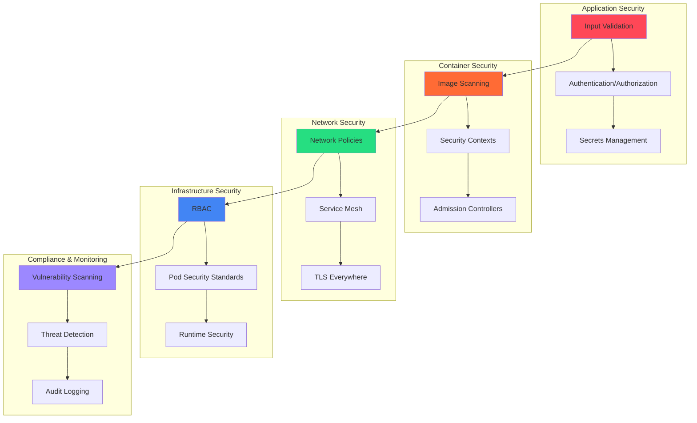
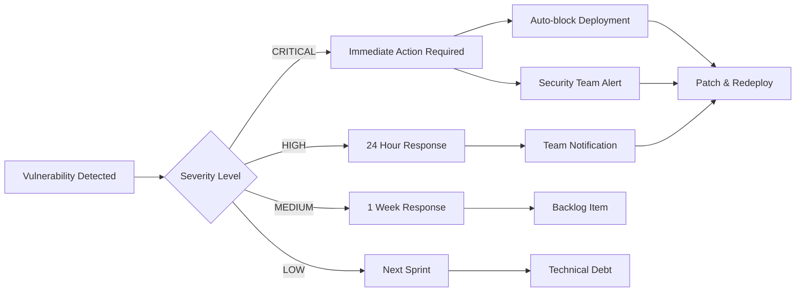
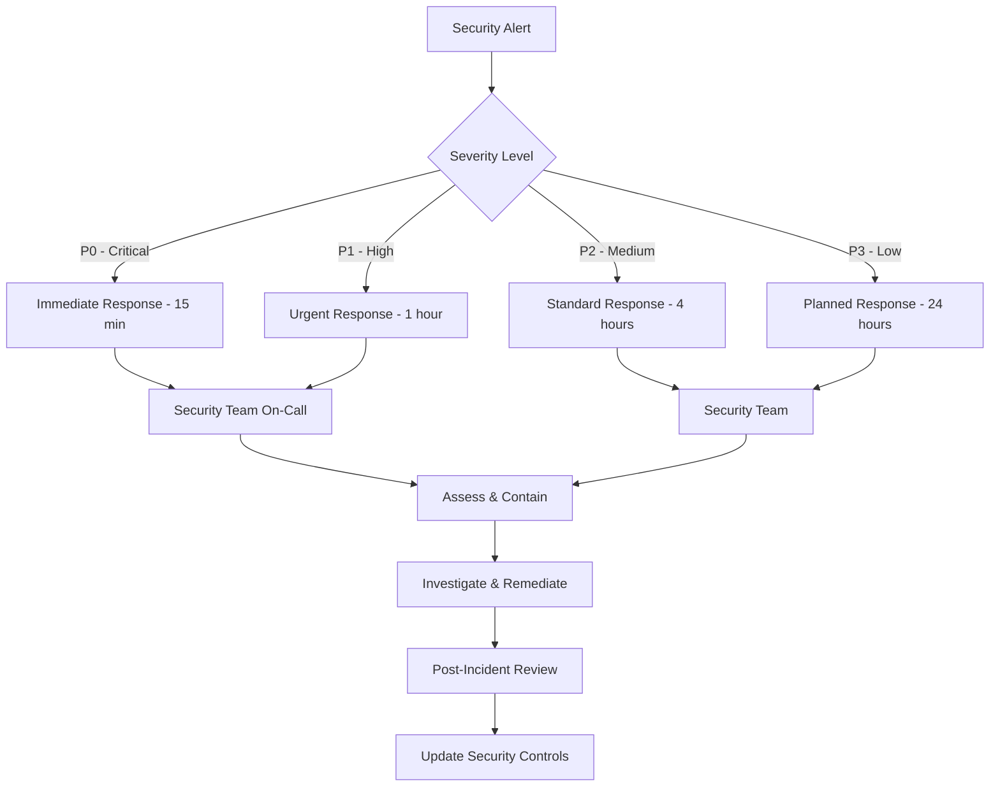

# 🛡️ Comprehensive Security Guide

A complete guide to the ML Platform's enterprise-grade security implementation, covering infrastructure security,
runtime protection, vulnerability management, and compliance.

## 🎯 Executive Summary

The ML Platform implements a **defense-in-depth security strategy** with zero-trust networking, comprehensive
vulnerability scanning, runtime threat detection, and automated compliance enforcement. Security is integrated into
every layer of the infrastructure and enforced through automated controls.

### Security Principles

- **🔐 Zero Trust**: Never trust, always verify
- **⚡ Fail Safe**: Security failures prevent deployment
- **📊 Observable**: All security events are logged and monitored
- **🔄 Automated**: Security policies enforced through automation
- **📋 Compliant**: SOC 2, ISO 27001, CIS Kubernetes alignment

## 🏗️ Security Architecture Overview



## 🔐 Identity & Access Management

### Service Accounts & RBAC

#### Team-Based Service Accounts

```yaml
# Each team gets dedicated service accounts with minimal permissions
apiVersion: v1
kind: ServiceAccount
metadata:
  name: ml-team-workload
  namespace: app-ml-team
  labels:
    app.kubernetes.io/team: ml-team
    security.platform/scope: team-workload
---
apiVersion: rbac.authorization.k8s.io/v1
kind: Role
metadata:
  namespace: app-ml-team
  name: ml-team-workload
rules:
- apiGroups: [""]
  resources: ["pods", "services", "configmaps", "secrets"]
  verbs: ["get", "list", "create", "update", "patch"]
- apiGroups: ["apps"]
  resources: ["deployments", "replicasets"]
  verbs: ["get", "list", "create", "update", "patch"]
# Explicitly deny cluster-level access
- apiGroups: [""]
  resources: ["nodes", "namespaces"]
  verbs: ["*"]
  resourceNames: [] # Deny all
```

#### Pod Security Standards

```yaml
# Enforced at namespace level
apiVersion: v1
kind: Namespace
metadata:
  name: app-ml-team
  labels:
    pod-security.kubernetes.io/enforce: restricted
    pod-security.kubernetes.io/audit: restricted
    pod-security.kubernetes.io/warn: restricted
```

#### Security Contexts (Required for all pods)

```yaml
spec:
  securityContext:
    runAsNonRoot: true
    runAsUser: 65534
    fsGroup: 65534
    seccompProfile:
      type: RuntimeDefault
  containers:
  - name: application
    securityContext:
      allowPrivilegeEscalation: false
      readOnlyRootFilesystem: true
      capabilities:
        drop: ["ALL"]
      runAsNonRoot: true
      runAsUser: 65534
```

## 🌐 Network Security

### Zero-Trust Network Policies

#### Default Deny-All Policy

```yaml
apiVersion: networking.k8s.io/v1
kind: NetworkPolicy
metadata:
  name: default-deny-all
  namespace: app-ml-team
spec:
  podSelector: {}
  policyTypes:
  - Ingress
  - Egress
```

#### Service-to-Service Communication

```yaml
apiVersion: networking.k8s.io/v1
kind: NetworkPolicy
metadata:
  name: ml-backend-access
  namespace: app-ml-team
spec:
  podSelector:
    matchLabels:
      app.kubernetes.io/name: ml-backend
  policyTypes:
  - Ingress
  - Egress
  ingress:
  # Allow only from approved sources
  - from:
    - podSelector:
        matchLabels:
          app.kubernetes.io/name: ml-frontend
    - namespaceSelector:
        matchLabels:
          name: ingress-nginx
    ports:
    - protocol: TCP
      port: 8080
  egress:
  # Allow only to approved destinations
  - to:
    - podSelector:
        matchLabels:
          app.kubernetes.io/name: postgresql
    ports:
    - protocol: TCP
      port: 5432
  # Allow DNS resolution
  - to: []
    ports:
    - protocol: UDP
      port: 53
    - protocol: TCP
      port: 53
```

### TLS Everywhere

```yaml
# Automatic TLS for ingress
apiVersion: networking.k8s.io/v1
kind: Ingress
metadata:
  name: ml-platform-ingress
  annotations:
    cert-manager.io/cluster-issuer: letsencrypt-prod
    nginx.ingress.kubernetes.io/ssl-redirect: "true"
    nginx.ingress.kubernetes.io/force-ssl-redirect: "true"
spec:
  tls:
  - hosts:
    - ml-platform.example.com
    secretName: ml-platform-tls
  rules:
  - host: ml-platform.example.com
    http:
      paths:
      - path: /
        pathType: Prefix
        backend:
          service:
            name: ml-frontend
            port:
              number: 80
```

## 📊 Vulnerability Scanning & Management

### Multi-Layer Scanning Strategy

#### 1. Container Image Scanning (Trivy)

**Trivy Server (Actually Deployed)**:

```yaml
# Trivy server deployment in security-scanning namespace
apiVersion: apps/v1
kind: Deployment
metadata:
  name: trivy-server
  namespace: security-scanning
  labels:
    app.kubernetes.io/name: trivy-server
    app.kubernetes.io/component: security-scanner
spec:
  replicas: 1
  selector:
    matchLabels:
      app.kubernetes.io/name: trivy-server
  template:
    metadata:
      labels:
        app.kubernetes.io/name: trivy-server
    spec:
      serviceAccountName: trivy-server
      securityContext:
        runAsNonRoot: true
        runAsUser: 65534
        fsGroup: 65534
      containers:
      - name: trivy-server
        image: aquasec/trivy:0.48.1
        args:
        - server
        - --listen
        - 0.0.0.0:4954
        securityContext:
          allowPrivilegeEscalation: false
          readOnlyRootFilesystem: true
          capabilities:
            drop: ["ALL"]
        ports:
        - name: http
          containerPort: 4954
          protocol: TCP
        resources:
          limits:
            memory: 1Gi
            cpu: 500m
          requests:
            memory: 512Mi
            cpu: 100m
```

**CI/CD Integration**:

```yaml
# GitHub Actions example
- name: Run Trivy vulnerability scanner
  uses: aquasecurity/trivy-action@master
  with:
    image-ref: ${{ env.REGISTRY }}/${{ env.IMAGE_NAME }}:${{ github.sha }}
    format: 'sarif'
    output: 'trivy-results.sarif'
    severity: 'CRITICAL,HIGH'
    exit-code: '1' # Fail build on vulnerabilities

- name: Upload Trivy scan results
  uses: github/codeql-action/upload-sarif@v2
  if: always()
  with:
    sarif_file: 'trivy-results.sarif'
```

#### 2. Infrastructure Scanning (Multiple Tools)

**Terraform Security (Checkov)**:

```bash
# Automated in CI/CD
checkov -d infrastructure/terraform \
  --framework terraform \
  --output cli \
  --output sarif \
  --output-file-path checkov-results.sarif \
  --soft-fail
```

**Kubernetes Manifests (Kubesec)**:

```bash
# Scan Kubernetes manifests
kubesec scan infrastructure/kubernetes/base/app-ml-platform/backend.yaml
```

**Container Images (Hadolint)**:

```bash
# Dockerfile linting
hadolint infrastructure/Dockerfile \
  --format sarif \
  > hadolint-results.sarif
```

#### 3. Production Scanning (AWS Integration)

**ECR Enhanced Scanning**:

```hcl
resource "aws_ecr_repository" "app_repository" {
  name                 = "ml-platform/backend"
  image_tag_mutability = "MUTABLE"

  image_scanning_configuration {
    scan_on_push = true
  }

  encryption_configuration {
    encryption_type = "AES256"
  }
}

# Enhanced scanning for critical images
resource "aws_inspector2_enabler" "enhanced_scanning" {
  account_ids    = [data.aws_caller_identity.current.account_id]
  resource_types = ["ECR"]
}
```

### Vulnerability Response Process



## 🔍 Runtime Security & Threat Detection

### Falco Runtime Security

#### Core Falco Deployment

```yaml
apiVersion: apps/v1
kind: DaemonSet
metadata:
  name: falco
  namespace: security-scanning
spec:
  template:
    spec:
      serviceAccountName: falco
      hostNetwork: true
      hostPID: true
      tolerations:
      - effect: NoSchedule
        key: node-role.kubernetes.io/control-plane
      containers:
      - name: falco
        image: falcosecurity/falco-no-driver:0.36.2
        args:
        - /usr/bin/falco
        - --cri
        - /run/containerd/containerd.sock
        - -K
        - /var/run/secrets/kubernetes.io/serviceaccount/token
        - -k
        - https://$(KUBERNETES_SERVICE_HOST)
        securityContext:
          privileged: true # Required for system monitoring
        volumeMounts:
        - mountPath: /host/var/run/docker.sock
          name: docker-socket
        - mountPath: /host/dev
          name: dev-fs
          readOnly: true
        - mountPath: /host/proc
          name: proc-fs
          readOnly: true
        resources:
          limits:
            cpu: 1000m
            memory: 1024Mi
          requests:
            cpu: 100m
            memory: 512Mi
```

#### Custom Security Rules

```yaml
apiVersion: v1
kind: ConfigMap
metadata:
  name: falco-custom-rules
  namespace: security-scanning
data:
  ml-platform-rules.yaml: |
    # ML Platform specific security rules
    
    # Detect privilege escalation attempts
    - rule: Privilege Escalation Attempt
      desc: Detect attempts to escalate privileges
      condition: >
        spawned_process and
        (proc.name=su or proc.name=sudo or proc.name=passwd) and
        not container.image.repository in (trusted_images)
      output: >
        Privilege escalation attempt detected (user=%user.name 
        command=%proc.cmdline container=%container.name 
        image=%container.image.repository)
      priority: WARNING
      tags: [security, privilege_escalation]
    
    # Detect unexpected network connections
    - rule: Unexpected Outbound Connection
      desc: Detect unexpected outbound network connections
      condition: >
        outbound and
        fd.sip.name != "" and
        not fd.sip.name in (allowed_external_domains) and
        container.name != ""
      output: >
        Unexpected outbound connection (connection=%fd.name 
        container=%container.name image=%container.image.repository)
      priority: INFO
      tags: [network, security]
    
    # Detect sensitive file access
    - rule: Sensitive File Access
      desc: Detect access to sensitive files
      condition: >
        open_read and
        (fd.name startswith /etc/passwd or
         fd.name startswith /etc/shadow or
         fd.name startswith /root/.ssh/ or
         fd.name startswith /home/*/.ssh/) and
        not proc.name in (authorized_processes)
      output: >
        Sensitive file accessed (file=%fd.name user=%user.name 
        command=%proc.cmdline container=%container.name)
      priority: WARNING
      tags: [filesystem, security]
```

### Threat Detection Integration

#### AWS GuardDuty (Production)

```hcl
resource "aws_guardduty_detector" "ml_platform" {
  enable = true
  
  malware_protection {
    scan_ec2_instance_with_findings {
      ebs_volumes = true
    }
  }
  
  kubernetes {
    audit_logs {
      enable = true
    }
  }
  
  tags = {
    Environment = var.environment
    Purpose     = "threat-detection"
  }
}

# EventBridge integration for real-time alerts
resource "aws_cloudwatch_event_rule" "guardduty_findings" {
  name_prefix = "guardduty-ml-platform"
  
  event_pattern = jsonencode({
    source      = ["aws.guardduty"]
    detail-type = ["GuardDuty Finding"]
    detail = {
      severity = [7.0, 8.0, 8.5, 9.0, 9.5, 10.0] # HIGH and CRITICAL only
    }
  })
}
```

## 🔒 Secrets Management

### Kubernetes Secrets with External Secrets Operator

#### External Secrets Configuration

```yaml
apiVersion: external-secrets.io/v1beta1
kind: SecretStore
metadata:
  name: aws-secrets-manager
  namespace: app-ml-team
spec:
  provider:
    aws:
      service: SecretsManager
      region: us-west-2
      auth:
        secretRef:
          accessKeyID:
            name: aws-creds
            key: access-key-id
          secretAccessKey:
            name: aws-creds
            key: secret-access-key
---
apiVersion: external-secrets.io/v1beta1
kind: ExternalSecret
metadata:
  name: database-credentials
  namespace: app-ml-team
spec:
  refreshInterval: 1h
  secretStoreRef:
    name: aws-secrets-manager
    kind: SecretStore
  target:
    name: database-connection
    creationPolicy: Owner
  data:
  - secretKey: username
    remoteRef:
      key: ml-platform/database
      property: username
  - secretKey: password
    remoteRef:
      key: ml-platform/database
      property: password
```

#### Secret Rotation Strategy

```bash
# Automated secret rotation (example script)
#!/bin/bash
set -euo pipefail

NAMESPACE="app-ml-team"
SECRET_NAME="database-connection"

# Generate new password
NEW_PASSWORD=$(openssl rand -base64 32)

# Update in AWS Secrets Manager
aws secretsmanager update-secret \
  --secret-id "ml-platform/database" \
  --secret-string "{\"username\":\"app_user\",\"password\":\"$NEW_PASSWORD\"}"

# External Secrets Operator will automatically sync within 1 hour
# Or force refresh:
kubectl annotate externalsecret database-credentials \
  force-sync=$(date +%s) \
  -n $NAMESPACE
```

### Environment-Specific Credentials

#### Local Development (.env)

```bash
# .env.example - Template for local development
# Copy to .env and update with secure values

# Database Configuration
POSTGRES_DB=app_db
POSTGRES_USER=app_user
POSTGRES_PASSWORD=your_secure_password_here

# Redis Configuration  
REDIS_PASSWORD=your_redis_password_here

# MinIO Configuration
MINIO_ROOT_USER=minioadmin
MINIO_ROOT_PASSWORD=your_minio_password_here

# Application Secrets
JWT_SECRET_KEY=your_jwt_secret_here
ENCRYPTION_KEY=your_encryption_key_here
```

#### Production (AWS Secrets Manager)

```hcl
resource "aws_secretsmanager_secret" "database_credentials" {
  name        = "ml-platform/database"
  description = "Database credentials for ML Platform"
  
  replica {
    region = "us-east-1"
  }
  
  tags = {
    Environment = var.environment
    Service     = "database"
    Rotation    = "enabled"
  }
}

resource "aws_secretsmanager_secret_version" "database_credentials" {
  secret_id = aws_secretsmanager_secret.database_credentials.id
  secret_string = jsonencode({
    username = var.db_username
    password = random_password.db_password.result
  })
}

# Automatic rotation
resource "aws_secretsmanager_secret_rotation" "database_rotation" {
  secret_id           = aws_secretsmanager_secret.database_credentials.id
  rotation_lambda_arn = aws_lambda_function.secret_rotation.arn
  
  rotation_rules {
    automatically_after_days = 30
  }
}
```

## 🚨 Security Monitoring & Alerting

### Comprehensive Monitoring Stack

#### Security Metrics Collection

```yaml
apiVersion: v1
kind: ServiceMonitor
metadata:
  name: security-metrics
  namespace: security-scanning
spec:
  selector:
    matchLabels:
      app.kubernetes.io/component: security
  endpoints:
  - port: metrics
    interval: 30s
    path: /metrics
```

#### Alert Rules

```yaml
apiVersion: monitoring.coreos.com/v1
kind: PrometheusRule
metadata:
  name: security-alerts
  namespace: security-scanning
spec:
  groups:
  - name: security.rules
    rules:
    - alert: HighSeverityVulnerability
      expr: trivy_vulnerabilities{severity="HIGH"} > 0
      for: 0m
      labels:
        severity: warning
        team: security
      annotations:
        summary: "High severity vulnerability detected"
        description: "{{ $labels.image }} has {{ $value }} high severity vulnerabilities"
    
    - alert: CriticalSeverityVulnerability
      expr: trivy_vulnerabilities{severity="CRITICAL"} > 0
      for: 0m
      labels:
        severity: critical
        team: security
      annotations:
        summary: "Critical vulnerability detected - immediate action required"
        description: "{{ $labels.image }} has {{ $value }} CRITICAL vulnerabilities"
    
    - alert: FalcoSecurityEvent
      expr: increase(falco_events_total[5m]) > 10
      for: 1m
      labels:
        severity: warning
        team: security
      annotations:
        summary: "Unusual security events detected by Falco"
        description: "{{ $value }} security events in the last 5 minutes"
    
    - alert: PodSecurityViolation
      expr: increase(kubernetes_admission_denied_total{reason="PodSecurity"}[5m]) > 0
      for: 0m
      labels:
        severity: warning
        team: platform
      annotations:
        summary: "Pod Security Standard violation"
        description: "Pod deployment blocked due to security policy violation"
```

## 🎯 CI/CD Security Enforcement

### Zero-Trust Deployment Pipeline

#### Admission Controller for CI/CD-Only Deployments

```yaml
apiVersion: admissionregistration.k8s.io/v1
kind: ValidatingAdmissionWebhook
metadata:
  name: ci-cd-only-deployment
spec:
  clientConfig:
    service:
      name: security-admission-controller
      namespace: security-scanning
      path: "/validate-deployment"
  rules:
  - operations: ["CREATE", "UPDATE"]
    apiGroups: ["apps"]
    apiVersions: ["v1"]
    resources: ["deployments"]
  admissionReviewVersions: ["v1", "v1beta1"]
  sideEffects: None
  failurePolicy: Fail # Fail safe - deny if webhook is down
```

#### Service Account for CI/CD

```yaml
apiVersion: v1
kind: ServiceAccount
metadata:
  name: ci-cd-deployment
  namespace: app-ml-team
  annotations:
    security.platform/deployment-method: "ci-cd-only"
    security.platform/image-scan-required: "true"
---
apiVersion: rbac.authorization.k8s.io/v1
kind: Role
metadata:
  namespace: app-ml-team
  name: ci-cd-deployer
rules:
- apiGroups: ["apps"]
  resources: ["deployments"]
  verbs: ["create", "update", "patch", "get", "list"]
- apiGroups: [""]
  resources: ["services", "configmaps"]
  verbs: ["create", "update", "patch", "get", "list"]
# Explicitly deny dangerous operations
- apiGroups: [""]
  resources: ["secrets"]
  verbs: ["get", "list"] # Read-only access to secrets
```

### Pipeline Security Checks

#### GitHub Actions Security Pipeline

```yaml
name: Security Pipeline
on:
  push:
    branches: [main, develop]
  pull_request:
    branches: [main]

jobs:
  security-scan:
    runs-on: ubuntu-latest
    steps:
    - uses: actions/checkout@v4
    
    # 1. Secret scanning
    - name: Run TruffleHog OSS
      uses: trufflesecurity/trufflehog@main
      with:
        path: ./
        base: main
        head: HEAD
        extra_args: --debug --only-verified
    
    # 2. Dependency scanning
    - name: Run Snyk security scan
      uses: snyk/actions/node@master
      env:
        SNYK_TOKEN: ${{ secrets.SNYK_TOKEN }}
      with:
        args: --severity-threshold=high
    
    # 3. Infrastructure scanning
    - name: Run Checkov
      uses: bridgecrewio/checkov-action@master
      with:
        directory: infrastructure/terraform
        framework: terraform
        output_format: sarif
        output_file_path: checkov-results.sarif
    
    # 4. Container image scanning
    - name: Build and scan image
      run: |
        docker build -t ${{ env.IMAGE_NAME }}:${{ github.sha }} .
        
        # Scan with Trivy
        docker run --rm -v /var/run/docker.sock:/var/run/docker.sock \
          aquasec/trivy image \
          --format sarif \
          --output trivy-results.sarif \
          --severity HIGH,CRITICAL \
          --exit-code 1 \
          ${{ env.IMAGE_NAME }}:${{ github.sha }}
    
    # 5. Upload all results to GitHub Security
    - name: Upload security scan results
      uses: github/codeql-action/upload-sarif@v2
      if: always()
      with:
        sarif_file: trivy-results.sarif
```

## 📋 Compliance & Audit

### Audit Logging Configuration

#### Kubernetes Audit Policy

```yaml
apiVersion: audit.k8s.io/v1
kind: Policy
rules:
# Log security-sensitive operations at highest level
- level: RequestResponse
  resources:
  - group: ""
    resources: ["secrets", "serviceaccounts"]
  - group: "rbac.authorization.k8s.io"
    resources: ["roles", "rolebindings", "clusterroles", "clusterrolebindings"]

# Log deployment operations
- level: Request
  resources:
  - group: "apps"
    resources: ["deployments", "daemonsets", "statefulsets"]
  - group: ""
    resources: ["pods"]

# Log network policy changes
- level: RequestResponse
  resources:
  - group: "networking.k8s.io"
    resources: ["networkpolicies"]

# Log admission controller decisions
- level: Request
  users: ["system:serviceaccount:security-scanning:admission-controller"]

# Exclude routine operations
- level: None
  resources:
  - group: ""
    resources: ["events"]
```

### Compliance Frameworks

#### CIS Kubernetes Benchmark

```bash
# Automated compliance checking with kube-bench
apiVersion: batch/v1
kind: Job
metadata:
  name: kube-bench-compliance
  namespace: security-scanning
spec:
  template:
    spec:
      hostPID: true
      containers:
      - name: kube-bench
        image: aquasec/kube-bench:v0.6.15
        command: ["kube-bench"]
        args: ["--json", "--outputfile", "/tmp/results/report.json"]
        volumeMounts:
        - name: var-lib-etcd
          mountPath: /var/lib/etcd
          readOnly: true
        - name: var-lib-kubelet
          mountPath: /var/lib/kubelet
          readOnly: true
        - name: etc-kubernetes
          mountPath: /etc/kubernetes
          readOnly: true
        - name: results
          mountPath: /tmp/results
      volumes:
      - name: var-lib-etcd
        hostPath:
          path: "/var/lib/etcd"
      - name: var-lib-kubelet
        hostPath:
          path: "/var/lib/kubelet"
      - name: etc-kubernetes
        hostPath:
          path: "/etc/kubernetes"
      - name: results
        persistentVolumeClaim:
          claimName: compliance-results
      restartPolicy: Never
```

#### SOC 2 Controls Implementation

```yaml
# Resource tagging for audit trails
metadata:
  labels:
    security.compliance/soc2-control: "CC6.1" # Logical access controls
    security.compliance/data-classification: "internal"
    security.compliance/retention-period: "7-years"
    security.ownership/team: "ml-team"
    security.ownership/data-steward: "ml-team-lead@company.com"
```

## 🚀 Security Best Practices

### Development Guidelines

#### Secure Coding Practices

1. **Input Validation**: Validate all inputs at application boundaries
2. **Parameterized Queries**: Use prepared statements for database queries
3. **Authentication**: Implement multi-factor authentication
4. **Authorization**: Follow principle of least privilege
5. **Error Handling**: Don't expose sensitive information in errors
6. **Logging**: Log security events but not sensitive data

#### Container Security Checklist

- [ ] Use minimal base images (distroless when possible)
- [ ] Run as non-root user
- [ ] Set read-only root filesystem
- [ ] Drop all capabilities
- [ ] Set resource limits
- [ ] Scan for vulnerabilities
- [ ] Sign images with cosign
- [ ] Use specific image tags (not latest)

#### Infrastructure Security Checklist

- [ ] Enable audit logging
- [ ] Implement network policies
- [ ] Use Pod Security Standards
- [ ] Configure RBAC properly
- [ ] Enable admission controllers
- [ ] Implement secret rotation
- [ ] Monitor for drift
- [ ] Regular security assessments

### Incident Response

#### Security Incident Workflow



#### Emergency Procedures

```bash
# 1. Immediate containment
kubectl drain <compromised-node> --ignore-daemonsets --delete-emptydir-data

# 2. Isolate affected workloads
kubectl label node <node-name> security.status=quarantined
kubectl taint node <node-name> security=compromised:NoSchedule

# 3. Collect forensics
kubectl logs <pod-name> -n <namespace> --previous > incident-logs.txt
kubectl describe pod <pod-name> -n <namespace> > pod-details.txt

# 4. Block network access
kubectl apply -f - <<EOF
apiVersion: networking.k8s.io/v1
kind: NetworkPolicy
metadata:
  name: emergency-isolation
  namespace: <affected-namespace>
spec:
  podSelector:
    matchLabels:
      security.status: compromised
  policyTypes:
  - Ingress
  - Egress
EOF
```

## 📚 Security Resources

### Documentation Links

- [OWASP Top 10](https://owasp.org/www-project-top-ten/)
- [CIS Kubernetes Benchmark](https://www.cisecurity.org/benchmark/kubernetes)
- [NIST Cybersecurity Framework](https://www.nist.gov/cyberframework)
- [Kubernetes Security Best Practices](https://kubernetes.io/docs/concepts/security/)

### Internal References

- [Architecture Overview](ARCHITECTURE.md)
- [Operational Runbooks](OPERATIONAL_RUNBOOKS.md)
- [Monitoring Guide](MONITORING-GUIDE.md)
- [ArgoCD Security Implementation](ARGOCD-SECURITY-IMPLEMENTATION-GUIDE.md)

### Security Tools Documentation

- [Trivy Documentation](https://aquasecurity.github.io/trivy/)
- [Falco Rules](https://falco.org/docs/rules/)
- [OPA Gatekeeper Policies](https://open-policy-agent.github.io/gatekeeper/)
- [External Secrets Operator](https://external-secrets.io/)

---

**🔒 Remember**: Security is everyone's responsibility. When in doubt, choose the more secure option.

*This security guide is maintained by the Security and Platform Engineering teams and reviewed quarterly.*
