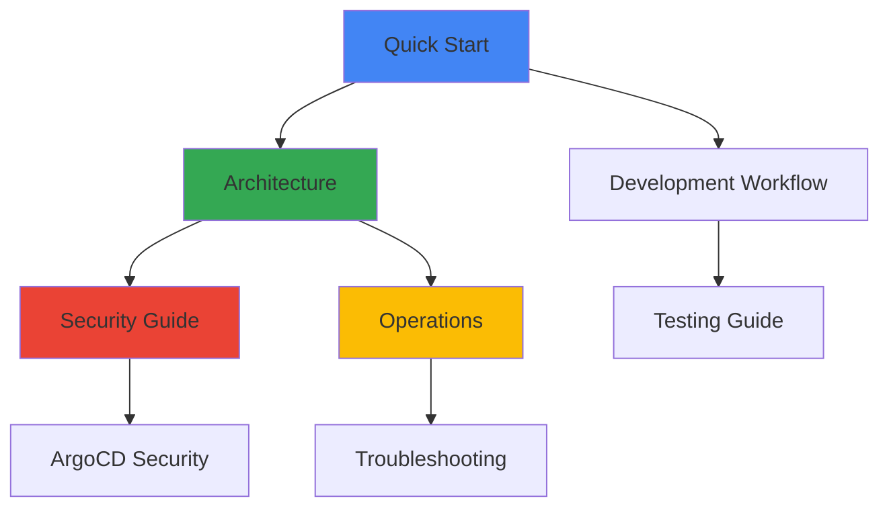

# 📚 Infrastructure Documentation Catalog

**World-class documentation for the ML Platform infrastructure - organized, comprehensive, and up-to-date.**

**Last Updated:** January 2025  
**Total Documentation:** 35+ files across structured categories  
**Status:** ✅ Actively maintained and regularly updated

## 🚀 Quick Navigation

### 🎯 **New to the Platform?**

Start here for the fastest path to productivity:

1. **[🚀 Quick Start Guide](getting-started/QUICK-START.md)** - Get running in 30 minutes
2. **[👨‍💻 Development Workflow](getting-started/DEVELOPMENT-WORKFLOW.md)** - Daily development tasks
3. **[🏗️ Architecture Overview](ARCHITECTURE.md)** - Understand the system design
4. **[⚡ Add New Application](ADD-NEW-APPLICATION.md)** - Deploy your first app

### 🎓 **Complete Onboarding**

For comprehensive team onboarding:

- **[📖 New Engineer Runbook](NEW-ENGINEER-RUNBOOK.md)** - Complete 3-4 hour guided experience

## 📂 Documentation Structure

### 🏁 Getting Started

Essential guides for new users and quick development setup.

| Document                                                            | Purpose                            | Time Required |
|---------------------------------------------------------------------|------------------------------------|---------------|
| **[Quick Start](getting-started/QUICK-START.md)**                   | Get platform running in 30 minutes | 30 min        |
| **[Development Workflow](getting-started/DEVELOPMENT-WORKFLOW.md)** | Day-to-day development guide       | 45 min        |
| **[Tool Installation](getting-started/TOOL-INSTALLATION.md)**       | Required tools setup               | 20 min        |

### 🏗️ Core Architecture

High-level system design and architectural decisions.

| Document                                                          | Purpose                      | Audience           |
|-------------------------------------------------------------------|------------------------------|--------------------|
| **[Architecture Overview](ARCHITECTURE.md)**                      | Complete system architecture | All teams          |
| **[Best Practices](BEST-PRACTICES.md)**                           | Development standards        | Developers         |
| **[Implementation Summary](reference/IMPLEMENTATION-SUMMARY.md)** | What's built and working     | Product/Management |

### 🔐 Security

Comprehensive security implementation and best practices.

| Document                                                                | Purpose                          | Security Level |
|-------------------------------------------------------------------------|----------------------------------|----------------|
| **[Security Guide](SECURITY-COMPREHENSIVE-GUIDE.md)**                   | Complete security implementation | All            |
| **[Security Scanning](security/SECURITY-SCANNING-GUIDE.md)**            | Vulnerability management         | DevOps         |
| **[ArgoCD Security](security/ARGOCD-SECURITY-IMPLEMENTATION-GUIDE.md)** | GitOps security                  | Platform       |
| **[Basic Security](security/SECURITY.md)**                              | Credential management            | Developers     |

### ⚙️ Operations

Day-to-day operational procedures and troubleshooting.

| Document                                                       | Purpose               | Team       |
|----------------------------------------------------------------|-----------------------|------------|
| **[Operational Runbooks](operations/OPERATIONAL_RUNBOOKS.md)** | Emergency procedures  | SRE/DevOps |
| **[ArgoCD Operations](operations/ARGOCD-COMMANDS-GUIDE.md)**   | GitOps management     | All teams  |
| **[ArgoCD Migration](operations/ARGOCD-MIGRATION-GUIDE.md)**   | GitOps setup guide    | Platform   |
| **[ArgoCD CLI Setup](operations/ARGOCD-CLI-SETUP.md)**         | CLI configuration     | Developers |
| **[Maintenance](operations/MAINTENANCE.md)**                   | Regular maintenance   | Platform   |
| **[Workflows](operations/WORKFLOWS.md)**                       | Development workflows | All teams  |

### 🏗️ Infrastructure

Infrastructure setup, configuration, and management.

| Document                                                                | Purpose                 | Environment |
|-------------------------------------------------------------------------|-------------------------|-------------|
| **[Kind Cluster Config](infrastructure/KIND-CLUSTER-CONFIGURATION.md)** | Local development setup | Local       |
| **[Local VPC Simulation](infrastructure/LOCAL-VPC-SIMULATION.md)**      | Network simulation      | Local       |
| **[EKS Usage](infrastructure/EKS-USAGE.md)**                            | AWS production setup    | Production  |
| **[Docker Setup](infrastructure/DOCKER-SETUP.md)**                      | Container development   | Local       |
| **[Ingress Setup](infrastructure/INGRESS-SETUP.md)**                    | Traffic routing         | All         |
| **[Core Services Setup](infrastructure/CORE-SERVICES-NODE-SETUP.md)**   | Node configuration      | Production  |

### 📚 Reference

Quick references, troubleshooting, and implementation status.

| Document                                                         | Purpose             | Type      |
|------------------------------------------------------------------|---------------------|-----------|
| **[Testing Guide](reference/TESTING-GUIDE.md)**                  | Test procedures     | Reference |
| **[Troubleshooting](reference/TROUBLESHOOTING.md)**              | Common issues       | Reference |
| **[Quick Fixes](reference/QUICK-FIXES.md)**                      | Immediate solutions | Reference |
| **[Implementation Status](reference/IMPLEMENTATION-SUMMARY.md)** | Feature status      | Status    |

### 🎯 Specialized Topics

Advanced topics and specialized use cases.

#### GPU & ML Infrastructure

- **[GPU Node Management](GPU-NODE-MANAGEMENT.md)** - GPU resource management
- **[GPU Access Control](GPU-ACCESS-ML-TEAM-ONLY.md)** - Team-based GPU access
- **[GPU Simulation](GPU-SIMULATION-MACOS.md)** - Local GPU development
- **[Metal GPU Implementation](METAL-GPU-IMPLEMENTATION.md)** - Hardware GPU setup

#### Advanced Infrastructure

- **[Single Cluster Best Practices](SINGLE-CLUSTER-BEST-PRACTICES.md)** - Architecture decisions
- **[HA Control Plane](HA-CONTROL-PLANE-GUIDE.md)** - High availability setup
- **[K3s vs K8s](K3S_K8S.md)** - Kubernetes distribution comparison
- **[Node Usage Design](NODE-USAGE-DESIGN.md)** - Resource allocation strategy
- **[Labeling Summary](LABELING-SUMMARY.md)** - Resource organization

#### Terraform & Providers

- **[Terraform Comparison](TERRAFORM-COMPARISON.md)** - Architecture vs alternatives
- **[Terraform ArgoCD Governance](TERRAFORM-ARGOCD-GOVERNANCE.md)** - GitOps integration
- **[Terraform Version Standards](TERRAFORM-VERSION-STANDARDS.md)** - Version management
- **[Provider Version Management](PROVIDER-VERSION-MANAGEMENT.md)** - Enterprise versioning

#### Monitoring & Observability

- **[Monitoring Guide](MONITORING-GUIDE.md)** - Observability setup
- **[Metrics Server Config](METRICS-SERVER-CONFIGURATIONS.md)** - Metrics collection
- **[Prometheus CRDs](PROMETHEUS-CRDS.md)** - Custom monitoring
- **[Port Management](PORT-MANAGEMENT.md)** - Network configuration

#### Platform Comparisons

- **[Helm vs Shell Comparison](HELM-VS-SHELL-COMPARISON.md)** - Deployment strategies
- **[ECR Consolidation](ECR-CONSOLIDATION-SETUP.md)** - Container registry management
- **[Example Data Platform](EXAMPLE-DATA-PLATFORM.md)** - Reference implementation

### 📊 Diagrams & Visualizations

Interactive and visual documentation.

| Resource                                                                   | Purpose                      | Format    |
|----------------------------------------------------------------------------|------------------------------|-----------|
| **[Control Plane Architectures](diagrams/control-plane-architectures.md)** | Architecture diagrams        | Markdown  |
| **[Terraform Local Docs](diagrams/terraform-local-docs.md)**               | Infrastructure visualization | Generated |
| **[Infrastructure Diagrams](diagrams/index.html)**                         | Interactive visualization    | HTML      |
| **[Terraform Rover](diagrams/terraform-local-rover.html)**                 | Terraform visualization      | HTML      |
| **[MCP Visualization Setup](mcp-visualization-setup.md)**                  | Visualization tools          | Guide     |

## 🎯 Documentation Principles

### ✅ **Quality Standards**

- **Comprehensive**: Covers all aspects of the platform
- **Current**: Regularly updated and maintained
- **Practical**: Includes working examples and commands
- **Accessible**: Clear navigation and organization
- **Tested**: All examples are verified to work

### 📋 **Maintenance Process**

- **Quarterly Reviews**: Major updates and accuracy checks
- **Continuous Updates**: New features documented immediately
- **Community Contributions**: Team members contribute improvements
- **Version Control**: All changes tracked in Git

### 🔗 **Cross-References**

Documentation is highly interconnected with clear relationships:

## 🚦 Usage Guidelines

### 🎯 **For New Engineers**

1. Start with **[Quick Start](getting-started/QUICK-START.md)** (30 min)
2. Read **[Architecture Overview](ARCHITECTURE.md)** (1 hour)
3. Follow **[Development Workflow](getting-started/DEVELOPMENT-WORKFLOW.md)** (ongoing)
4. Reference **[Security Guide](SECURITY-COMPREHENSIVE-GUIDE.md)** as needed

### 🛠️ **For Daily Development**

- **Quick Issues**: [Troubleshooting](reference/TROUBLESHOOTING.md) + [Quick Fixes](reference/QUICK-FIXES.md)
- **New Features
  **: [Add New Application](ADD-NEW-APPLICATION.md) + [Development Workflow](getting-started/DEVELOPMENT-WORKFLOW.md)
- **Testing**: [Testing Guide](reference/TESTING-GUIDE.md)
- **Deployment**: [ArgoCD Operations](operations/ARGOCD-COMMANDS-GUIDE.md)

### 🔧 **For Infrastructure Work**

- **Local Setup**: [Kind Cluster Config](infrastructure/KIND-CLUSTER-CONFIGURATION.md)
- **Production**: [EKS Usage](infrastructure/EKS-USAGE.md)
- **Security**: [Security Guide](SECURITY-COMPREHENSIVE-GUIDE.md)
- **Operations**: [Operational Runbooks](operations/OPERATIONAL_RUNBOOKS.md)

### 📊 **For Management/Planning**

- **Status**: [Implementation Summary](reference/IMPLEMENTATION-SUMMARY.md)
- **Architecture**: [Architecture Overview](ARCHITECTURE.md)
- **Best Practices**: [Best Practices](BEST-PRACTICES.md)
- **Comparisons**: [Terraform Comparison](TERRAFORM-COMPARISON.md)

## 📈 Documentation Health

### ✅ **Status Overview**

| Category              | Documents | Status          | Last Updated |
|-----------------------|-----------|-----------------|--------------|
| **Getting Started**   | 3 docs    | ✅ Excellent     | January 2025 |
| **Core Architecture** | 3 docs    | ✅ Excellent     | January 2025 |
| **Security**          | 4 docs    | ✅ Comprehensive | January 2025 |
| **Operations**        | 6 docs    | ✅ Complete      | January 2025 |
| **Infrastructure**    | 6 docs    | ✅ Current       | January 2025 |
| **Reference**         | 4 docs    | ✅ Maintained    | January 2025 |
| **Specialized**       | 20+ docs  | ✅ Specialized   | January 2025 |

### 🎯 **Recent Improvements**

- ✅ **Consolidated Security Docs**: Merged 6 files into comprehensive guide
- ✅ **Organized Structure**: Created logical directory hierarchy
- ✅ **Enhanced Navigation**: Improved cross-references and quick access
- ✅ **Updated Architecture**: Added comprehensive system documentation
- ✅ **Removed Duplicates**: Eliminated redundant content

## 🤝 Contributing to Documentation

### 📝 **How to Contribute**

1. **Create Issue**: Identify documentation gaps or improvements
2. **Follow Standards**: Use existing templates and patterns
3. **Test Examples**: Verify all code examples work
4. **Update Cross-References**: Add links to related documentation
5. **Submit PR**: Include documentation updates with code changes

### 📋 **Documentation Standards**

- **Headers**: Use emoji + descriptive titles
- **Code Blocks**: Include language specification and context
- **Examples**: Provide working, tested examples
- **Links**: Use relative links for internal docs
- **Structure**: Follow established patterns and hierarchy

## 🆘 Getting Help

### 📖 **Documentation Questions**

- **First**: Search existing documentation
- **Issues**: Create GitHub issue for missing documentation
- **Slack**: Platform Engineering team for urgent questions
- **Email**: documentation@yourcompany.com for suggestions

### 🔍 **Finding Information**

1. **Use This Catalog**: Find the right document for your needs
2. **Search**: Use GitHub search or grep across documentation
3. **Browse Structure**: Explore the organized directories
4. **Follow Links**: Cross-references lead to related information

---

## 📚 Related Resources

### 🔗 **External Documentation**

- **[Main Project README](../../README.md)** - Project overview and quick start
- **[Terraform Modules](../terraform/modules/README.md)** - Infrastructure code documentation
- **[Kubernetes Manifests](../kubernetes/README.md)** - Application deployment configs

### 🛠️ **Development Tools**

- **Scripts**: [Automation scripts](../scripts/) for deployment and management
- **Tests**: [Test suites](../tests/) for validation and compliance
- **Examples**: [Usage examples](../../examples/) for common scenarios

---
