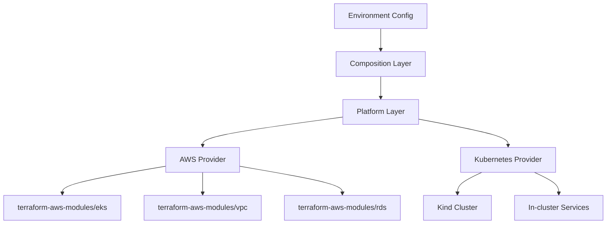

# Terraform Modules Documentation

## Module Organization

This directory contains our modular Terraform infrastructure organized into three layers:

```
modules/
├── compositions/     # High-level service orchestration
├── platform/        # Provider-agnostic interfaces  
└── providers/        # Provider-specific implementations
```

## 🎯 Design Philosophy

### Wrapper Pattern for Open Source Modules

We wrap excellent open source modules to provide:

- **Organizational consistency**: Standardized interfaces and naming
- **Environment abstraction**: Same code works locally and in cloud
- **Future flexibility**: Easy to swap providers or add features



## 📁 Module Layers

### 1. Compositions (`/compositions/`)

**Purpose**: Orchestrate complete environments or applications

**Example**: `data-platform`

- Coordinates cluster, database, cache, storage, monitoring
- Provides single interface for entire platform
- Handles environment-specific variations

```hcl
module "data_platform" {
  source = "./modules/compositions/data-platform"
  
  use_aws     = true  # Cloud vs local selection
  environment = "dev"
  # ... unified configuration
}
```

### 2. Platform (`/platform/`)

**Purpose**: Provider-agnostic service interfaces

**Example**: `cluster`

- Abstracts Kubernetes cluster management
- Works with both EKS (AWS) and Kind (local)
- Provides consistent outputs regardless of provider

```hcl
module "cluster" {
  source = "./modules/platform/cluster"
  
  use_aws = var.use_aws  # Selects provider automatically
  # ... same config for all providers
}
```

### 3. Providers (`/providers/`)

**Purpose**: Provider-specific implementations

#### AWS Providers (`/providers/aws/`)

- Wrap terraform-aws-modules for AWS services
- Add organizational defaults and standards
- Handle AWS-specific configuration

#### Kubernetes Providers (`/providers/kubernetes/`)

- Implement services for Kubernetes environments
- Handle local development scenarios
- Use Helm charts and Kubernetes manifests

## 🔧 Using Open Source Modules

### Current Integrations

| Service        | Local Provider | AWS Provider | Open Source Module          |
|----------------|----------------|--------------|-----------------------------|
| **Cluster**    | Kind           | EKS          | `terraform-aws-modules/eks` |
| **Networking** | Docker         | VPC          | `terraform-aws-modules/vpc` |
| **Database**   | PostgreSQL Pod | RDS          | `terraform-aws-modules/rds` |
| **Cache**      | Redis Pod      | ElastiCache  | -                           |
| **Storage**    | MinIO Pod      | S3           | -                           |

### Integration Pattern

```hcl
# In /providers/aws/cluster/main.tf
module "eks" {
  source  = "terraform-aws-modules/eks/aws"  # ← Open source
  version = "~> 20.0"
  
  # Our standardized configuration
  cluster_name = local.name_prefix
  vpc_id       = module.vpc.vpc_id
  
  # Map our variables to module inputs
  cluster_version = var.kubernetes_version
  
  # Apply our organizational defaults
  tags = merge(var.tags, local.common_tags)
}
```

### Benefits of This Approach

✅ **Zero Maintenance**: Open source modules maintained by community  
✅ **Latest Features**: Easy to adopt upstream improvements  
✅ **Best Practices**: Security and performance built-in  
✅ **Organizational Consistency**: Our standards applied uniformly  
✅ **Environment Flexibility**: Switch between local and cloud easily

## 🚀 Development Workflow

### 1. Local Development

```bash
cd environments/local
terraform apply
# Uses Kind cluster + in-cluster services
```

### 2. Cloud Development

```bash
cd environments/dev
terraform apply  
# Uses EKS + AWS managed services
```

### 3. Adding New Services

1. **Choose open source module** (if available)
2. **Create AWS provider wrapper**:
   ```bash
   mkdir modules/providers/aws/new-service
   ```
3. **Create Kubernetes provider implementation**:
   ```bash  
   mkdir modules/providers/kubernetes/new-service
   ```
4. **Create platform interface**:
   ```bash
   mkdir modules/platform/new-service
   ```
5. **Update composition** to include new service
6. **Test in both environments**

## 📋 Module Standards

### Input Variables

**Required patterns**:

```hcl
variable "name" {
  description = "Resource name"
  type        = string
}

variable "environment" {
  description = "Environment name" 
  type        = string
}

variable "tags" {
  description = "Resource tags"
  type        = map(string)
  default     = {}
}
```

### Output Values

**Required patterns**:

```hcl
output "connection" {
  description = "Service connection details"
  value = {
    endpoint = "..."
    port     = "..."
  }
  sensitive = true
}

output "credentials" {
  description = "Service credentials"
  value = {
    username = "..."
    password = "..."
  }
  sensitive = true
}
```

### Resource Naming

**Pattern**: `{environment}-{service}-{component}`

**Examples**:

- `dev-data-platform-cluster`
- `prod-ml-postgres-primary`
- `staging-cache-redis-001`

## 🔄 Update Process

### Monitoring Updates

```bash
# Check for module updates
terraform init -upgrade
terraform plan
```

### Testing Updates

1. **Dev environment first**:
   ```bash
   cd environments/dev
   terraform plan  # Review changes
   terraform apply
   ```

2. **Validate functionality**:
   ```bash
   kubectl get nodes
   # Test application deployments
   ```

3. **Promote to staging/prod**:
   ```bash
   cd environments/staging
   terraform apply
   ```

### Breaking Changes

When upstream modules have breaking changes:

1. **Review CHANGELOG** in upstream repository
2. **Update wrapper module** to handle new interface
3. **Test thoroughly** in development environment
4. **Update documentation** with migration notes
5. **Coordinate team** for production updates

## 🔍 Troubleshooting

### Common Issues

**Module not found**:

```bash
terraform init
# Re-download modules
```

**Version conflicts**:

```bash
rm -rf .terraform.lock.hcl
terraform init -upgrade
```

**State drift**:

```bash
terraform refresh
terraform plan
```

### Debug Process

1. **Enable verbose logging**:
   ```bash
   export TF_LOG=DEBUG
   terraform apply
   ```

2. **Check module source**:
   ```bash
   terraform get -update
   ```

3. **Validate configuration**:
   ```bash
   terraform validate
   terraform fmt -check
   ```

## 📚 References

### Internal Documentation

- [Architecture Overview](../ARCHITECTURE.md)
- [Environment Setup](../environments/README.md)
- [Contributing Guidelines](../CONTRIBUTING.md)

### External Resources

- [Terraform Module Registry](https://registry.terraform.io/)
- [terraform-aws-modules](https://github.com/terraform-aws-modules)
- [Terraform Best Practices](https://www.terraform.io/docs/modules/index.html)

### Specific Modules

- [EKS Module](https://github.com/terraform-aws-modules/terraform-aws-eks)
- [VPC Module](https://github.com/terraform-aws-modules/terraform-aws-vpc)
- [RDS Module](https://github.com/terraform-aws-modules/terraform-aws-rds)

---

**Last Updated**: January 2025  
**Next Review**: February 2025
