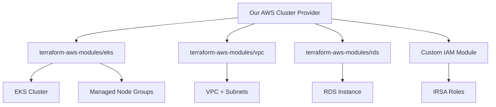

# AWS EKS Cluster Provider

This module wraps the official `terraform-aws-modules/eks` module to provide a standardized interface for EKS cluster
management within our infrastructure.

## Overview

**What this module does:**

- Creates production-ready EKS clusters using community best practices
- Provides organizational defaults and standards
- Handles VPC, IAM, security groups, and add-ons automatically
- Integrates with our platform abstraction layer

**What this module does NOT do:**

- Modify the upstream terraform-aws-modules/eks module
- Replace or fork open source modules
- Implement custom Kubernetes controllers

## 🏗️ Architecture



## 📦 Wrapped Open Source Modules

| Module                      | Version   | Purpose                     |
|-----------------------------|-----------|-----------------------------|
| `terraform-aws-modules/eks` | `~> 20.0` | EKS cluster and node groups |
| `terraform-aws-modules/vpc` | `~> 5.0`  | VPC and networking          |
| `terraform-aws-modules/rds` | `~> 6.0`  | Database instances          |

## 🚀 Usage

### Basic Usage

```hcl
module "aws_cluster" {
  source = "./modules/providers/aws/cluster"

  name               = "data-platform"
  environment        = "dev"
  kubernetes_version = "1.28"
  vpc_cidr          = "10.0.0.0/16"

  node_groups = {
    core_services = {
      instance_types = ["t3.medium"]
      capacity_type  = "SPOT"
      min_size       = 1
      max_size       = 3
      desired_size   = 2
      ami_type       = "AL2_x86_64"
      disk_size      = 50
      labels = {
        node-role = "core-services"
      }
      taints = {}
    }
  }

  tags = {
    Environment = "dev"
    Project     = "data-platform"
  }
}
```

### GPU Node Groups

```hcl
module "aws_cluster" {
  source = "./modules/providers/aws/cluster"
  
  # ... basic configuration
  
  node_groups = {
    gpu = {
      instance_types = ["g4dn.xlarge"]
      capacity_type  = "ON_DEMAND"
      min_size       = 0
      max_size       = 2
      desired_size   = 0
      ami_type       = "AL2_x86_64_GPU"
      disk_size      = 100
      labels = {
        node-role   = "gpu"
        gpu-type    = "nvidia"
        team-access = "ml-team"
      }
      taints = {
        gpu = {
          key    = "nvidia.com/gpu"
          value  = "true"
          effect = "NO_SCHEDULE"
        }
      }
    }
  }
}
```

### EFS Storage

```hcl
module "aws_cluster" {
  source = "./modules/providers/aws/cluster"
  
  # ... basic configuration
  
  enable_efs     = true
  efs_throughput = 100  # MiB/s
}
```

## 🔧 Configuration

### Required Variables

- `name` - Cluster name
- `environment` - Environment name (dev, staging, prod)

### Optional Variables

- `kubernetes_version` - Kubernetes version (default: "1.28")
- `vpc_cidr` - VPC CIDR block (default: "10.0.0.0/16")
- `node_groups` - Node group configurations
- `access_entries` - EKS access entries for team members
- `enable_efs` - Enable EFS for persistent storage
- `team_configurations` - Team-specific resource quotas and policies

### Node Group Configuration

```hcl
node_groups = {
  "group-name" = {
    instance_types = ["t3.medium"]      # EC2 instance types
    capacity_type  = "SPOT"             # SPOT or ON_DEMAND
    min_size       = 1                  # Minimum nodes
    max_size       = 3                  # Maximum nodes
    desired_size   = 2                  # Desired nodes
    ami_type       = "AL2_x86_64"       # AMI type
    disk_size      = 50                 # EBS disk size (GB)
    
    labels = {                          # Kubernetes labels
      node-role = "core-services"
      team      = "platform"
    }
    
    taints = {                          # Kubernetes taints
      "special-workload" = {
        key    = "workload"
        value  = "special"
        effect = "NO_SCHEDULE"
      }
    }
  }
}
```

## 📊 Outputs

### Cluster Information

- `cluster_name` - EKS cluster name
- `cluster_endpoint` - Kubernetes API endpoint
- `cluster_version` - Kubernetes version
- `cluster_ca_certificate` - CA certificate for authentication

### AWS-Specific

- `vpc_id` - VPC ID
- `private_subnets` - Private subnet IDs
- `public_subnets` - Public subnet IDs
- `ecr_repository_url` - ECR repository URL
- `irsa_role_arns` - IAM roles for service accounts

### Connection

- `kubectl_config_command` - Command to configure kubectl
- `kubeconfig` - Kubeconfig structure for programmatic access

## 🔐 IAM and Security

### Included IAM Roles

**Node Group Role:**

- `AmazonEKSWorkerNodePolicy`
- `AmazonEKS_CNI_Policy`
- `AmazonEC2ContainerRegistryReadOnly`
- `AmazonEBSCSIDriverPolicy`
- `AmazonEFSCSIDriverPolicy`

**IRSA Roles:**

- AWS Load Balancer Controller
- EBS CSI Driver
- EFS CSI Driver
- External DNS
- Cluster Autoscaler

### Security Groups

**Cluster Security Group:**

- Managed by EKS module
- Follows AWS best practices
- Additional rules for ephemeral ports

**Node Security Group:**

- Node-to-node communication
- Cluster API access
- Additional custom rules as needed

## 🔄 Updates and Maintenance

### Updating Upstream Modules

```hcl
# Current versions
module "eks" {
  source  = "terraform-aws-modules/eks/aws"
  version = "~> 20.8"  # Update this
}

module "vpc" {
  source  = "terraform-aws-modules/vpc/aws"  
  version = "~> 5.5"   # Update this
}
```

### Testing Updates

```bash
# Test in development
cd environments/dev
terraform init -upgrade
terraform plan
terraform apply

# Validate cluster
kubectl get nodes
kubectl get pods --all-namespaces
```

### Breaking Changes

Monitor these repositories for breaking changes:

- [terraform-aws-modules/eks](https://github.com/terraform-aws-modules/terraform-aws-eks/releases)
- [terraform-aws-modules/vpc](https://github.com/terraform-aws-modules/terraform-aws-vpc/releases)

## 🎯 Best Practices

### Cost Optimization

```hcl
node_groups = {
  core_services = {
    capacity_type = "SPOT"              # Use SPOT for cost savings
    instance_types = ["t3.medium", "t3.large"]  # Multiple types for better availability
  }
}

# Single NAT gateway for dev environments
# (automatically configured based on environment)
```

### Security

```hcl
# Limit access to specific CIDR blocks
access_entries = {
  "developer-team" = {
    kubernetes_groups = ["developers"]
    principal_arn     = "arn:aws:iam::123456789012:role/DeveloperRole"
    policy_associations = {
      developer_policy = {
        policy_arn = "arn:aws:eks::aws:cluster-access-policy/AmazonEKSViewPolicy"
        access_scope = {
          type       = "namespace"
          namespaces = ["dev-apps"]
        }
      }
    }
  }
}
```

### Monitoring

```hcl
# Enable CloudWatch logging (included by default)
# EKS adds-ons include metrics server
# Use provided IRSA roles for monitoring tools
```

## 🚨 Troubleshooting

### Common Issues

**Authentication Error:**

```bash
aws eks update-kubeconfig --region us-west-2 --name data-platform-dev
```

**Node Group Launch Issues:**

```bash
# Check IAM permissions
aws sts get-caller-identity

# Check subnet capacity
aws ec2 describe-subnets --subnet-ids subnet-xxx
```

**Add-on Failures:**

```bash
# Check add-on status
aws eks describe-addon --cluster-name data-platform-dev --addon-name aws-ebs-csi-driver
```

### Debug Commands

```bash
# Check cluster status
kubectl cluster-info
kubectl get nodes -o wide

# Check system pods
kubectl get pods -n kube-system

# Check events
kubectl get events --sort-by='.lastTimestamp'
```

## 📚 References

### Upstream Documentation

- [terraform-aws-modules/eks](https://github.com/terraform-aws-modules/terraform-aws-eks)
- [EKS User Guide](https://docs.aws.amazon.com/eks/latest/userguide/)
- [EKS Best Practices](https://aws.github.io/aws-eks-best-practices/)

### Internal Documentation

- [Platform Cluster Interface](../../platform/cluster/README.md)
- [Data Platform Composition](../../compositions/data-platform/README.md)
- [Update Guide](../../../UPDATE_GUIDE.md)

---

**Module Version**: 1.0.0  
**Upstream EKS Module**: ~> 20.0  
**Last Updated**: January 2025
